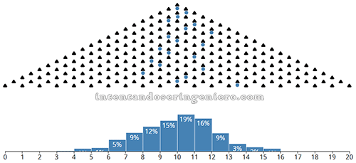

```{r message=FALSE}
library("ggplot2")
library("ggthemes")
library("scales") # for pretty_breaks
library("knitr") # setting options
library("gridExtra") # for arrangeGrob
options(scipen=500000)
set.seed(271)
```

```{r global_options, include=FALSE}
opts_chunk$set(fig.width=8, fig.height=4)
N = 1e4
```

## Summary

This is a quick overview into a common distribution of data that can really throw off distance dependent algorithms such as clustering or similarity scores.

Assuming the data conforms to a Gaussian distribution and then normalizing the data to the standard normal distribution is a common first step.  If your data set contains a skewed distribution such as a log normal distribution, the normalization process can reduce classifiers to a binary classification of 1) outlier or 2) not.

## Normal/Gaussian Distributions

$X = \mu + \sigma z$



source: [Intentando ser ingeniero](https://www.tumblr.com/search/gauss)

```{r}
df <- data.frame(comet = rnorm(N) * 20 + 400)

ggplot(df, aes(x=seq_along(comet), y=comet)) +
  geom_point(alpha=0.15) +
  theme_economist() + scale_colour_economist() +
  ggtitle("Comet Timeseries") +
  ylab("Comet") + xlab("time")
```


```{r}
ts_comet <- ggplot(df, aes(x=seq_along(comet), y=comet)) +
  geom_point(alpha=0.15) +
  theme_economist() + scale_colour_economist() +
  theme(legend.position="none",plot.margin=unit(c(0,0,0,0),"points")) +
  ylab("Comet") + xlab("time")

theme0 <- function(...) theme( legend.position = "none",
                               panel.background = element_blank(),
                               panel.grid.major = element_blank(),
                               panel.grid.minor = element_blank(),
                               panel.margin = unit(0,"null"),
                               axis.ticks = element_blank(),
                               axis.text.x = element_blank(),
                               axis.text.y = element_blank(),
                               axis.title.x = element_blank(),
                               axis.title.y = element_blank(),
                               axis.ticks.length = unit(0,"null"),
                               axis.ticks.margin = unit(0,"null"),
                               panel.border=element_rect(color=NA),...)

hist_comet <- ggplot(df, aes(x=seq_along(comet), y=comet)) + 
  geom_histogram(aes(x=comet, y=-..density..), colour="black", fill="blue", alpha=0.2) +
  coord_flip() +
  theme_bw() +
  theme0(plot.margin = unit(c(-1,0,0.5,2.2),"lines"))

grid.arrange(arrangeGrob(hist_comet, ts_comet,ncol=2,widths=c(1,3)),heights=c(1,3))
```

Using `comet` as a distrance measurement.

```{r}
mean(df$comet)
sd(df$comet)
max(df$comet)
min(df$comet)
max(df$comet) - min(df$comet)
```

If this `comet` feature were paired with a second feature `mass` with a range of values of `max(mass) - min(mass) = 0.00004`, the classifier would basically ignore any contributions made by the `mass` data.

**A common problem encountered with clustering algorithms/similarity scores/etc is when numeric variables contain values of significatly different magnitudes.  Variables with larger numeric values will tend to dominate the creation of the distance metric.**

### The Standard Normal Distribution

One method to bring the `comet` and `mass` features down to equal footing is to scale them to a standard normal distribution.

Standard normal distributions have `mean = 0` and `standard deviation = 1` and provide for a "better" overall distance metric.

$z = \frac{x - \mu}{\sigma}$

If the population mean $\mu$ and population standard deviation $\sigma$ are unknown, they can be estimated with the sample mean $\bar{x}$ and sample standard deviation $s$.

$z = \frac{x - \bar{x}}{s}$


**Empirical Rule for the Starndard Normal Distribution**

| Range | Probability |
|-------|-------------|
| $P(|z| < 1)$ | `r 2 * (pnorm(1)-pnorm(0))` |
| $P(|z| < 2)$ | `r 2 * (pnorm(2)-pnorm(0))` |
| $P(|z| < 3)$ | `r 2 * (pnorm(3)-pnorm(0))` |
| $P(|z| < 4)$ | `r 2 * (pnorm(4)-pnorm(0))` |
| $P(|z| < 5)$ | `r 2 * (pnorm(5)-pnorm(0))` |

$\text{comet}_z = \frac{\text{comet} - \mu_{\text{comet}}}{\sigma_{\text{comet}}}$

```{r}
df$comet_z <- (df$comet - mean(df$comet)) / sd(df$comet)

ggplot(df, aes(x=comet_z)) +
  geom_histogram(aes(y=..density..), binwidth=0.25, colour="black", fill="blue", alpha=0.4) +
  theme_economist() + scale_colour_economist() +
  scale_x_continuous(breaks=pretty_breaks(n=21)) +
  geom_vline(xintercept=-3:3, color="red", linetype="dashed", size=2) +
  ggtitle("Histogram of Normalized Comet") +
  ylab("Density") + xlab("comet_z")
```

## Distances with Standard Normals

Converting Gaussian distributions to a standard normal distribution maps about 95% of the data points to values between -2 and 2.  This creates a predictable range of distance measurements between individual data points.

**Normalize your data to a standard normal distribution and all will be well!**

[insert hearts rainbows and unicorns]

## When Standard Normal Distributions Don't Work

For skew distributions, distances to outliers become more significant than distances between the rest of your data.

Example: [https://status.github.com](https://status.github.com/#graphs)

```{r}
df$load_time <- rlnorm(N, meanlog=3, sdlog=0.75)

ggplot(df, aes(x=seq_along(load_time), y=load_time)) +
  geom_point(alpha=0.15) +
  theme_economist() + scale_colour_economist() +
  ggtitle("Page Load Time") +
  ylab("Load Time") + xlab("")
```


```{r}
ts_page <- ggplot(df, aes(x=seq_along(load_time), y=load_time)) +
  geom_point(alpha=0.15) +
  theme_economist() + scale_colour_economist() +
  theme(legend.position="none",plot.margin=unit(c(0,0,0,0),"points")) +
  ylab("Page Load Time") + xlab("")

theme0 <- function(...) theme( legend.position = "none",
                               panel.background = element_blank(),
                               panel.grid.major = element_blank(),
                               panel.grid.minor = element_blank(),
                               panel.margin = unit(0,"null"),
                               axis.ticks = element_blank(),
                               axis.text.x = element_blank(),
                               axis.text.y = element_blank(),
                               axis.title.x = element_blank(),
                               axis.title.y = element_blank(),
                               axis.ticks.length = unit(0,"null"),
                               axis.ticks.margin = unit(0,"null"),
                               panel.border=element_rect(color=NA),...)

hist_page <- ggplot(df, aes(x=seq_along(load_time), y=load_time)) + 
  geom_histogram(aes(x=load_time, y=-..density..), colour="black", fill="blue", alpha=0.2) +
  coord_flip() +
  theme_bw() +
  theme0(plot.margin = unit(c(-1,0,0.5,2.2),"lines"))

grid.arrange(arrangeGrob(hist_page, ts_page,ncol=2,widths=c(1,3)),heights=c(1,3))
```

Following our process for Gaussian data, we normalize the page load time

```{r}
df$load_time_z <- (df$load_time - mean(df$load_time)) / sd(df$load_time)

ggplot(df, aes(x=load_time_z)) +
  geom_histogram(aes(y=..density..), binwidth=0.25, colour="black", fill="blue", alpha=0.4) +
  theme_economist() + scale_colour_economist() +
  scale_x_continuous(breaks=pretty_breaks(n=21)) +
  ggtitle("Standard Normalization of Page Load Times") +
  ylab("Density") + xlab("load_time_z")
```

| Range | Probability |
|-------|-------------|
| $P(|\text{load_time}_z| < 1)$ | `r sum(abs(df$load_time_z) < 1) / length(df$load_time_z)` |
| $P(|\text{load_time}_z| < 2)$ | `r sum(abs(df$load_time_z) < 2) / length(df$load_time_z)` |
| $P(|\text{load_time}_z| < 3)$ | `r sum(abs(df$load_time_z) < 3) / length(df$load_time_z)` |
| $P(|\text{load_time}_z| < 4)$ | `r sum(abs(df$load_time_z) < 4) / length(df$load_time_z)` |
| $P(|\text{load_time}_z| < 5)$ | `r sum(abs(df$load_time_z) < 5) / length(df$load_time_z)` |

Outliers become the issue.  Minimizing the distance for the skewed metrics gets a larger focus than gaussian data.


```{r}
quantile(df$comet_z, 0.999)
```

```{r}
quantile(df$load_time_z, 0.999)
```

## Handilng Outliers of a Log Normal Distribution

A log normal distribution is defined in terms of an exponential function that allows for a few very large outliers

$X = e^{\mu + \sigma z}$

Applying a logarithmic function to the data can compress the outliers a reduce their dominance on the distance metric.

$ln(X) = N(\mu, \sigma^2)$

```{r}
df$lload_time <- log(df$load_time)

ggplot(df, aes(x=lload_time)) +
  geom_histogram(aes(y=..density..), binwidth=0.25, colour="black", fill="blue", alpha=0.4) +
  theme_economist() + scale_colour_economist() +
  scale_x_continuous(breaks=pretty_breaks(n=21)) +
  ggtitle("Log of Page Load Times") +
  ylab("Density") + xlab("ln(load_time)")
```

### Normalized Log Normal Distances

```{r}
df$lload_time_z <- (df$lload_time - mean(df$lload_time)) / sd(df$lload_time)

ggplot(df, aes(x=lload_time_z)) +
  geom_histogram(aes(y=..density..), binwidth=0.25, colour="black", fill="blue", alpha=0.4) +
  theme_economist() + scale_colour_economist() +
  scale_x_continuous(breaks=pretty_breaks(n=21)) +
  geom_vline(xintercept=-3:3, color="red", linetype="dashed", size=2) +
  ylab("Density") + xlab("ln(load_time)_z")
```

## TLDL (Too long didn't listen)

* Always inspect your data
* Always normalize your data
* Standard Normals are a good place to start
* Log normals can help with skewed outliers
